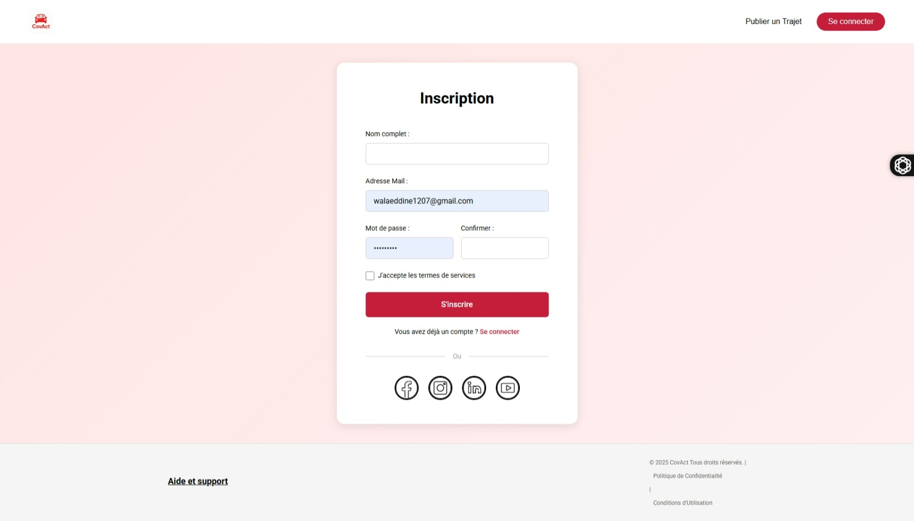
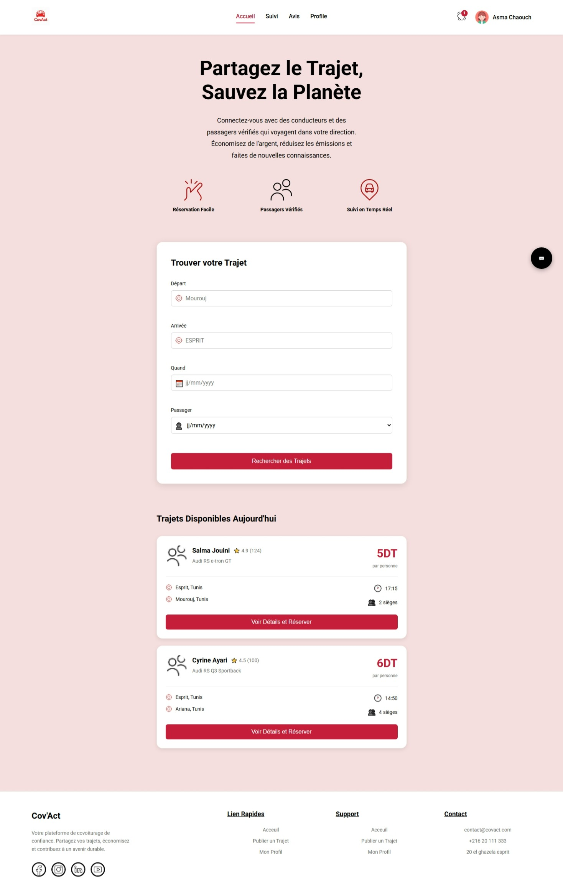
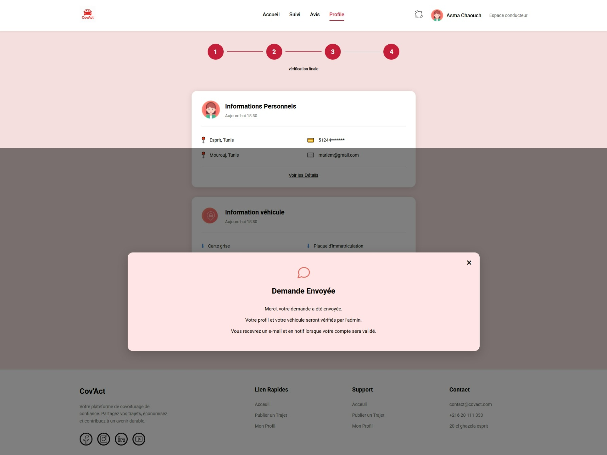
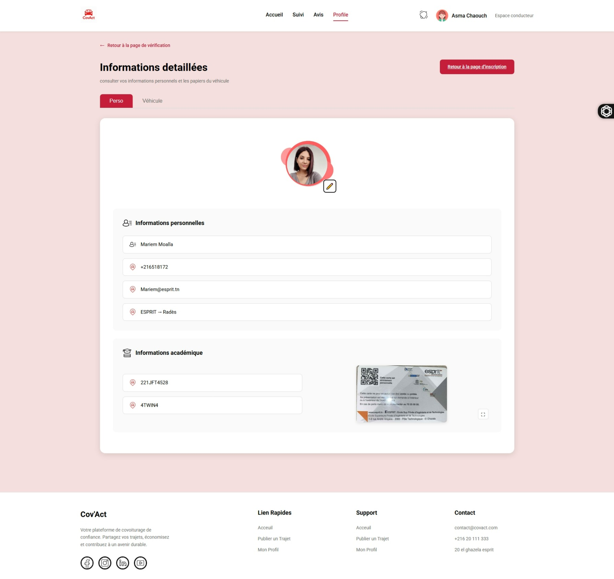
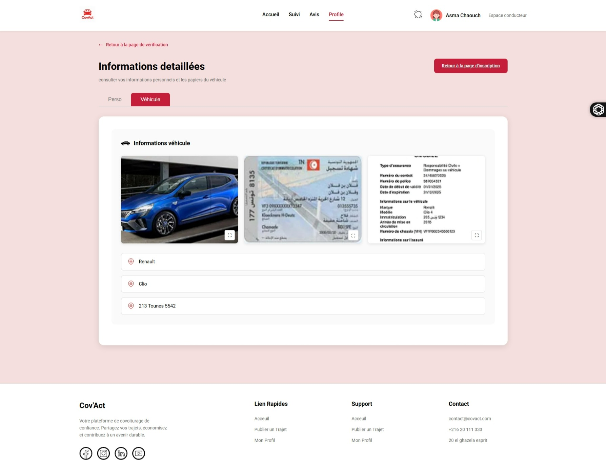

# 🚗 Cov'Act - Plateforme de Covoiturage Étudiant


## 📋 Table des Matières

- [Description](#-description)
- [Fonctionnalités](#-fonctionnalités)
- [Charte Graphique](#-charte-graphique)
- [Technologies Utilisées](#-technologies-utilisées)
- [Installation](#-installation)
- [Structure du Projet](#-structure-du-projet)
- [Pages et Navigation](#-pages-et-navigation)
- [Captures d'Écran](#-captures-décran)
- [Template de Conception](#-template-de-conception)
- [Contribution](#-contribution)

---

## 📖 Description

**Cov'Act** est une plateforme de covoiturage conçue spécifiquement pour les étudiants. Elle permet aux étudiants vérifiés de publier et de réserver des trajets en toute sécurité, tout en contribuant à la réduction de l'empreinte carbone et en économisant sur les frais de transport.

### 🎯 Objectifs

- Faciliter le covoiturage entre étudiants
- Vérifier l'identité des conducteurs et passagers
- Offrir une expérience utilisateur intuitive et sécurisée
- Promouvoir la mobilité durable

---

## ✨ Fonctionnalités

### Pour les Passagers

- 🔍 **Recherche de trajets** - Trouver des trajets disponibles par départ, destination et date
- 👤 **Profils vérifiés** - Consulter les profils et avis des conducteurs
- ⭐ **Système d'évaluation** - Noter et commenter les trajets
- 🔔 **Notifications en temps réel** - Recevoir des alertes sur l'état des réservations

### Pour les Conducteurs

- 📝 **Inscription étudiant** - Processus en 4 étapes avec vérification
- 🚗 **Publication de trajets** - Proposer des trajets quotidiens
- 📄 **Documents vérifiés** - Carte grise, assurance et carte étudiante
- 👥 **Gestion des passagers** - Accepter ou refuser des demandes
- 💬 **Messagerie intégrée** - Communication directe avec les passagers

### Fonctionnalités Générales

- 🔐 **Authentification sécurisée** - Inscription et connexion avec options sociales
- 📍 **Intégration Google Maps** - Visualisation et planification d'itinéraires
- 📊 **Tableau de bord** - Suivi des trajets et statistiques
- 💳 **Paiement sécurisé** - Transactions protégées

---

## 🎨 Charte Graphique

### Palette de Couleurs

#### Couleurs Principales

```css
--primary-red: #c41e3a; /* Rouge principal - CTA, éléments actifs */
--background-light: #f4dede; /* Fond clair rosé */
--white: #ffffff; /* Fond des cartes et sections */
```

#### Couleurs Secondaires

```css
--message-pink: #ffe5e5; /* Fond des messages/cartes d'information */
--notification-orange: #ffd4c2; /* Fond des notifications */
--gray-button: #6b6b6b; /* Boutons secondaires */
--text-dark: #000000; /* Texte principal */
--text-gray: #666666; /* Texte secondaire */
```

#### Couleurs d'État

```css
--success-green: #4caf50; /* Validation, succès */
--warning-yellow: #ffc107; /* Avertissements */
--error-red: #f44336; /* Erreurs */
--info-blue: #2196f3; /* Informations */
```

### Typographie

#### Police Principale

- **Font Family**: Roboto (Google Fonts)
- **Weights**: 300 (Light), 400 (Regular), 500 (Medium), 700 (Bold)

#### Tailles de Police

```css
--heading-xl: 48px; /* Titres principaux */
--heading-l: 36px; /* Titres de section */
--heading-m: 24px; /* Sous-titres */
--heading-s: 18px; /* Titres de carte */
--body-l: 16px; /* Texte principal */
--body-m: 14px; /* Texte secondaire */
--body-s: 12px; /* Légendes, labels */
```

### Espacements

```css
--spacing-xs: 4px;
--spacing-s: 8px;
--spacing-m: 16px;
--spacing-l: 24px;
--spacing-xl: 32px;
--spacing-2xl: 48px;
--spacing-3xl: 64px;
```

### Bordures et Ombres

```css
--border-radius-s: 8px;
--border-radius-m: 12px;
--border-radius-l: 16px;
--border-radius-xl: 24px;

--shadow-light: 0 2px 8px rgba(0, 0, 0, 0.1);
--shadow-medium: 0 4px 16px rgba(0, 0, 0, 0.15);
--shadow-heavy: 0 8px 24px rgba(0, 0, 0, 0.2);
```

### Icônes et Assets

#### Icônes Utilisées

- 📍 **Localisation**: `reticule-de-localisation 1.png`
- 🔔 **Notifications**: `notification.png`
- 👤 **Profil**: `profile.png`
- 🚗 **Véhicule**: `car-icon.png`, `voiture-bleue.png`
- 💬 **Message**: `Message circle.png`
- ✅ **Approbation**: `approved.png`
- 📄 **Documents**: `carte-grise.png`, `assurance.png`, `carte-etudiant.png`

#### Réseaux Sociaux

- Facebook: `icon/image 13.png`
- Instagram: `icon/image 14.png`
- LinkedIn: `icon/image 15.png`
- YouTube: `icon/image 16.png`

---

## 🛠️ Technologies Utilisées

### Frontend

- **React** 19.2.0 - Framework JavaScript
- **React Router DOM** 7.9.6 - Gestion de la navigation
- **CSS3** - Stylisation avec modules CSS

### Outils de Développement

- **Create React App** 5.0.1 - Configuration et build
- **React Scripts** - Scripts de développement
- **Web Vitals** - Métriques de performance

### Services Externes

- **Google Maps API** - Cartographie et itinéraires
- **Google Fonts** - Typographie Roboto

### Testing

- **React Testing Library** 16.3.0
- **Jest DOM** 6.9.1
- **User Event** 13.5.0

---

## 📦 Installation

### Prérequis

- Node.js (version 14 ou supérieure)
- npm ou yarn
- Un navigateur moderne (Chrome, Firefox, Safari, Edge)

### Installation Locale

1. **Cloner le repository**

   ```bash
   git clone https://github.com/walaeddine-riahi/projet_ux.git
   cd projet_ux/project
   ```

2. **Installer les dépendances**

   ```bash
   npm install
   ```

3. **Lancer l'application en mode développement**

   ```bash
   npm start
   ```

   L'application sera accessible sur [http://localhost:3000](http://localhost:3000)

4. **Build pour la production**

   ```bash
   npm run build
   ```

   Les fichiers optimisés seront dans le dossier `build/`

5. **Lancer les tests**
   ```bash
   npm test
   ```

---

## 📁 Structure du Projet

```
project/
├── public/
│   ├── assets/
│   │   ├── icon/              # Icônes (réseaux sociaux, etc.)
│   │   ├── logo-covact.png    # Logo principal
│   │   ├── notification.png   # Icône de notification
│   │   ├── profile.png        # Photo de profil par défaut
│   │   ├── voiture-bleue.png  # Image de véhicule
│   │   ├── carte-grise.png    # Document carte grise
│   │   ├── assurance.png      # Document assurance
│   │   └── carte-etudiant.png # Carte d'étudiant
│   ├── index.html
│   └── manifest.json
│
├── src/
│   ├── components/            # Composants réutilisables
│   │
│   ├── pages/                 # Pages de l'application
│   │   ├── Home.js            # Page d'accueil
│   │   ├── Home.css
│   │   ├── Login.js           # Page de connexion
│   │   ├── Signup.js          # Page d'inscription
│   │   ├── App.css            # Styles globaux
│   │   │
│   │   ├── InscriptionEtudiant.js     # Étape 1 - Inscription
│   │   ├── InscriptionEtudiant.css
│   │   ├── TrajetsQuotidiens.js       # Étape 2 - Trajets
│   │   ├── TrajetsQuotidiens.css
│   │   ├── VerificationInfos.js       # Étape 3 - Vérification
│   │   ├── VerificationInfos.css
│   │   ├── ProfileConducteur.js       # Profil conducteur
│   │   ├── ProfileConducteur.css
│   │   ├── VerificationFinale.js      # Étape 4 - Confirmation
│   │   ├── VerificationFinale.css
│   │   │
│   │   ├── InformationsDetailees.js   # Détails du profil
│   │   ├── InformationsDetailees.css
│   │   ├── Notifications.js           # Page notifications
│   │   └── Notifications.css
│   │
│   ├── App.js                 # Composant principal avec routes
│   ├── index.js               # Point d'entrée
│   └── index.css              # Styles globaux de base
│
├── screenshots/               # Captures d'écran de l'application
├── package.json
├── package-lock.json
└── README.md
```

---

## 🗺️ Pages et Navigation

### Schéma de Navigation

```
┌─────────────┐
│    Login    │─────────────┐
└──────┬──────┘             │
       │                    │
       ▼                    │
┌─────────────┐             │
│   Signup    │             │
└──────┬──────┘             │
       │                    │
       ▼                    ▼
┌─────────────────────────────┐
│           Home              │◄────────┐
└──────┬──────────────────────┘         │
       │                                │
       ▼                                │
┌─────────────────────────────┐         │
│ Inscription Étudiant (1/4)  │         │
└──────┬──────────────────────┘         │
       │                                │
       ▼                                │
┌─────────────────────────────┐         │
│ Trajets Quotidiens (2/4)    │         │
└──────┬──────────────────────┘         │
       │                                │
       ▼                                │
┌─────────────────────────────┐         │
│ Profile Conducteur (3/4)    │◄────┐   │
└──────┬──────────────────────┘     │   │
       │                            │   │
       ▼                            │   │
┌─────────────────────────────┐     │   │
│ Vérification Finale (4/4)   │     │   │
└──────┬──────────────────────┘     │   │
       │                            │   │
       └────────────────────────────┴───┘

┌─────────────────────────────┐
│  Informations Détaillées    │◄────── Accessible depuis Profile
└─────────────────────────────┘

┌─────────────────────────────┐
│      Notifications          │◄────── Accessible de toutes les pages
└─────────────────────────────┘
```

### Description des Pages

#### 1. **Login** (`/login`)

- Authentification des utilisateurs existants
- Options de connexion sociale (Facebook, Instagram, LinkedIn, YouTube)
- Lien vers la page d'inscription
- Navigation: → Home

#### 2. **Signup** (`/signup`)

- Création de nouveau compte
- Validation des informations (nom, email, mot de passe)
- Acceptation des termes de service
- Navigation: → Inscription Étudiant

#### 3. **Home** (`/`)

- Page d'accueil principale
- Recherche de trajets disponibles
- Liste des trajets du jour avec détails (conducteur, prix, horaires)
- Bouton "Publier un Trajet" → Inscription Étudiant
- Navigation complète via header

#### 4. **Inscription Étudiant** (`/inscription-etudiant`) - **Étape 1/4**

- Formulaire d'informations personnelles
- Upload de photo de profil
- Informations académiques (numéro étudiant, niveau)
- Upload carte d'étudiant
- Informations véhicule (marque, modèle, plaque)
- Documents requis (carte grise, assurance)
- Navigation: → Trajets Quotidiens

#### 5. **Trajets Quotidiens** (`/trajets-quotidiens`) - **Étape 2/4**

- Sélection position de départ
- Sélection position de destination
- Intégration Google Maps avec itinéraire
- Option de mémorisation du trajet
- Navigation: ← Inscription Étudiant | → Profile Conducteur

#### 6. **Profile Conducteur** (`/profile-conducteur`) - **Étape 3/4**

- Vérification des informations personnelles
- Vérification des informations véhicule
- Message "Demande Envoyée" inline
- Boutons "Voir les Détails" → Informations Détaillées
- Navigation: ← Trajets Quotidiens | → Vérification Finale

#### 7. **Vérification Finale** (`/verification-finale`) - **Étape 4/4**

- Popup modal de confirmation "Demande Envoyée"
- Récapitulatif final
- Navigation: ← Profile Conducteur | → Home (Confirmation)

#### 8. **Informations Détaillées** (`/informations-detaillees`)

- Onglets: Informations Personnelles / Véhicule
- **Onglet Perso**:
  - Photo de profil avec bouton d'édition
  - Informations personnelles (nom, téléphone, email, localisation)
  - Informations académiques (ID étudiant, classe, carte étudiante)
- **Onglet Véhicule**:
  - Informations véhicule (marque, modèle, plaque)
  - Photos du véhicule, carte grise, assurance
- Navigation: ← Profile Conducteur

#### 9. **Notifications** (`/notifications`)

- Onglet "Non lues" avec badge
- Notifications d'approbation de profil
- Design avec carte orange distinctive
- Accessible via icône de notification (présente sur toutes les pages)

---

## 📸 Captures d'Écran

### Authentification

#### Login


- Interface épurée avec formulaire de connexion
- Options de connexion sociale
- Lien vers inscription

#### Signup



- Formulaire d'inscription complet
- Validation du mot de passe
- Acceptation des conditions

---

### Page d'Accueil

#### Home



- Hero section avec slogan
- Fonctionnalités clés (Réservation facile, Passagers vérifiés, Suivi temps réel)
- Carte de recherche de trajets
- Liste des trajets disponibles avec détails

---

### Processus d'Inscription Conducteur (4 Étapes)

#### Étape 1: Inscription Étudiant


- Formulaire multi-sections:
  - 👤 Informations personnelles
  - 🎓 Informations académiques
  - 🚗 Informations véhicule
  - 📄 Documents requis
- Indicateur de progression (1/4)

#### Étape 2: Trajets Quotidiens


- Sélection départ/destination
- Carte Google Maps interactive
- Bouton itinéraire
- Indicateur de progression (2/4)

#### Étape 3: Profile Conducteur


- Vérification informations personnelles
- Vérification informations véhicule
- Message "Demande Envoyée" inline
- Indicateur de progression (3/4)

#### Étape 4: Vérification Finale



- Popup modal de confirmation
- Récapitulatif final
- Indicateur de progression (4/4)

---

### Pages Additionnelles

#### Informations Détaillées



- Onglet Informations Personnelles
- Photo de profil éditable
- Cartes d'information avec icônes



- Onglet Véhicule
- Photos du véhicule et documents

#### Notifications


- Liste des notifications non lues
- Badge de compteur
- Carte de notification d'approbation

---

## 🎯 Template de Conception

### Architecture des Composants

#### Header Standard

```jsx
<header className="header">
  <div className="header-left">
    <Link to="/">
      
    </Link>
  </div>
  <nav className="nav-menu">
    <Link to="/">Accueil</Link>
    <a href="#suivi">Suivi</a>
    <a href="#avis">Avis</a>
    <a href="#profile">Profile</a>
  </nav>
  <div className="header-right">
    <Link to="/notifications">
      
      <span className="badge">1</span>
    </Link>
    <div className="user-profile">
      
      <span>Nom Utilisateur</span>
    </div>
  </div>
</header>
```

#### Footer Standard

```jsx
<footer className="footer">
  <div className="footer-container">
    <div className="footer-column">
      <h3>Cov'Act</h3>
      <p>Description...</p>
      <div className="footer-social">{/* Liens réseaux sociaux */}</div>
    </div>
    <div className="footer-column">
      <h4>Lien Rapides</h4>
      <ul>{/* Liens */}</ul>
    </div>
    <div className="footer-column">
      <h4>Support</h4>
      <ul>{/* Liens */}</ul>
    </div>
    <div className="footer-column">
      <h4>Contact</h4>
      <ul>{/* Coordonnées */}</ul>
    </div>
  </div>
</footer>
```

#### Card Pattern

```jsx
<div className="card">
  <div className="card-header">
    
    <h3 className="card-title">Titre</h3>
  </div>
  <div className="card-content">{/* Contenu */}</div>
  <div className="card-actions">
    <button className="btn-primary">Action</button>
  </div>
</div>
```

#### Progress Indicator (4 Steps)

```jsx
<div className="progress-container">
  <div className="steps">
    <div className={`step ${currentStep >= 1 ? "active" : ""}`}>
      <div className="step-number">1</div>
      <div className="step-label">Label</div>
    </div>
    <div className="step-line"></div>
    {/* Répéter pour 2, 3, 4 */}
  </div>
</div>
```

### Patterns CSS Réutilisables

#### Buttons

```css
/* Primary Button */
.btn-primary {
  background-color: #c41e3a;
  color: white;
  padding: 12px 32px;
  border: none;
  border-radius: 8px;
  font-weight: 500;
  cursor: pointer;
  transition: all 0.3s ease;
}

.btn-primary:hover {
  background-color: #a01828;
  transform: translateY(-2px);
  box-shadow: 0 4px 12px rgba(196, 30, 58, 0.3);
}

/* Secondary Button */
.btn-secondary {
  background-color: #6b6b6b;
  color: white;
  /* ... same properties */
}

/* Outline Button */
.btn-outline {
  background-color: transparent;
  color: #c41e3a;
  border: 2px solid #c41e3a;
  /* ... same properties */
}
```

#### Form Inputs

```css
.form-group {
  margin-bottom: 20px;
}

.form-label {
  display: block;
  font-weight: 500;
  margin-bottom: 8px;
  color: #000;
}

.form-input {
  width: 100%;
  padding: 12px 16px;
  border: 1px solid #e0e0e0;
  border-radius: 8px;
  font-size: 14px;
  transition: border-color 0.3s;
}

.form-input:focus {
  outline: none;
  border-color: #c41e3a;
  box-shadow: 0 0 0 3px rgba(196, 30, 58, 0.1);
}
```

#### Cards

```css
.card {
  background-color: white;
  border-radius: 12px;
  padding: 24px;
  box-shadow: 0 2px 8px rgba(0, 0, 0, 0.1);
  transition: transform 0.3s, box-shadow 0.3s;
}

.card:hover {
  transform: translateY(-4px);
  box-shadow: 0 8px 24px rgba(0, 0, 0, 0.15);
}
```

---

## 🔐 Sécurité et Bonnes Pratiques

### Vérification des Utilisateurs

- Validation des cartes étudiantes
- Vérification des documents du véhicule (carte grise, assurance)
- Système de notation et d'avis
- Modération par administrateur

### Protection des Données

- Chiffrement des informations sensibles
- Conformité RGPD
- Politique de confidentialité claire
- Données stockées de manière sécurisée

### Performance

- Images optimisées
- Lazy loading des composants
- Code splitting avec React Router
- Cache des données

---

## 👥 Contribution

### Comment Contribuer

1. **Fork le projet**
2. **Créer une branche** pour votre fonctionnalité
   ```bash
   git checkout -b feature/AmazingFeature
   ```
3. **Commit vos changements**
   ```bash
   git commit -m 'Add some AmazingFeature'
   ```
4. **Push vers la branche**
   ```bash
   git push origin feature/AmazingFeature
   ```
5. **Ouvrir une Pull Request**

### Guidelines de Code

- Utiliser les composants fonctionnels avec Hooks
- Suivre la charte graphique établie
- Préfixer les classes CSS selon la page (ex: `home-`, `ie-`, `tq-`)
- Commenter le code complexe
- Tester les modifications avant de commit

---

## 📝 License

Ce projet est développé dans un cadre académique.

---

## 📞 Contact

**Équipe Cov'Act**

- Email: contact@covact.com
- Téléphone: +216 20 111 333
- Adresse: 20 el ghazela esprit, Tunis, Tunisie

---

## 🙏 Remerciements

- ESPRIT - École Supérieure Privée d'Ingénierie et de Technologies
- Google Maps API pour l'intégration cartographique
- React Community pour le support et la documentation
- Tous les contributeurs du projet

---

<div align="center">
  <p>Fait avec ❤️ pour une mobilité durable</p>
  <p>© 2025 Cov'Act - Tous droits réservés</p>
</div>
